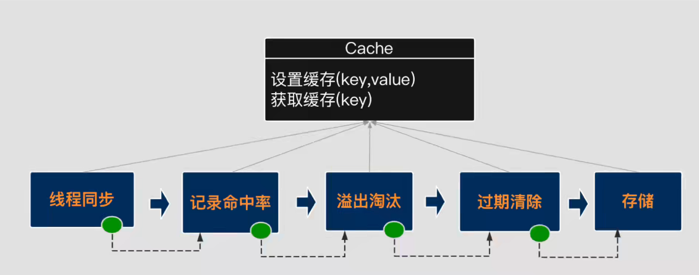

## 责任链模式

> 框架中应用
> 1. SpringMVC 中的 DispatchServlet
> 2. MyBatis 中的 Cache
     > 

责任链由多个节点（处理器）组成。 在行为模式上有两种：

1. 遍历链条上的节点，直到找到对应节点，然后处理为止，这种叫**经典责任链**模式
2. 由各个节点依次处理，共享负担责任的一部分，称为**变种责任链**模式 两种模式在结构上也会不一样，前者基于数组进行遍历，后者通过引用组成链表